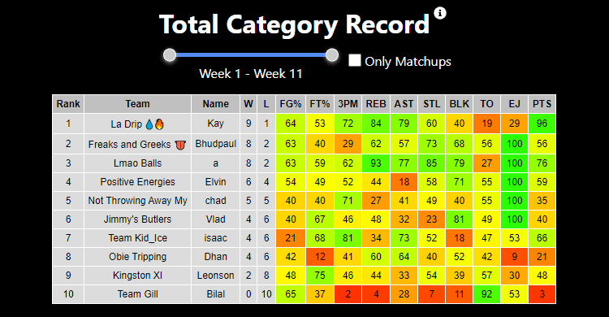
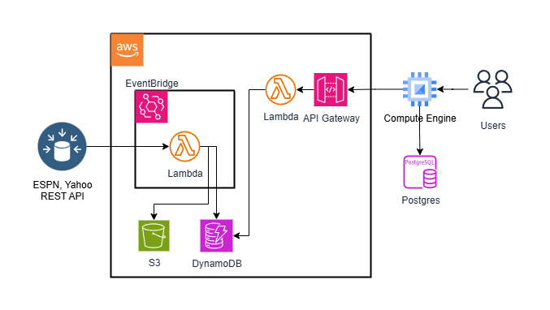

# Fantasy Basketball Analytics



Explore the project: [Fantasy Basketball Visualized](https://fantasy.elvinfeng.com)

## Overview

Fantasy Basketball Analytics is a personal project that leverages ESPN’s and Yahoo's API to provide actionable insights and visualizations for fantasy basketball leagues. Hundreds of daily users use this platform to generate personal insights, alerts, and visual tables to highlight team strengths and weaknesses. Originally built with vanilla JavaScript and Python scripts, the project has evolved to use modern web technologies and cloud-native infrastructure.

## Architecture



## Technology Stack

Frontend - JavaScript, React \
Backend - Python, Lambda, DynamoDB, API Gateway \
Deployment - Docker, Github Actions

## Getting Started (Client)

1. **Clone the repository:**
   ```sh
   git clone https://github.com/E-Feng/FantasyBBallAnalytics.git
   cd FantasyBBallAnalytics
   ```

2. **Install dependencies:**
   ```sh
   cd client
   npm install
   cd ..
   npm run dev
   ```

## Contributing

Pull requests are welcome! For major changes, please open an issue first to discuss what you would like to change.
